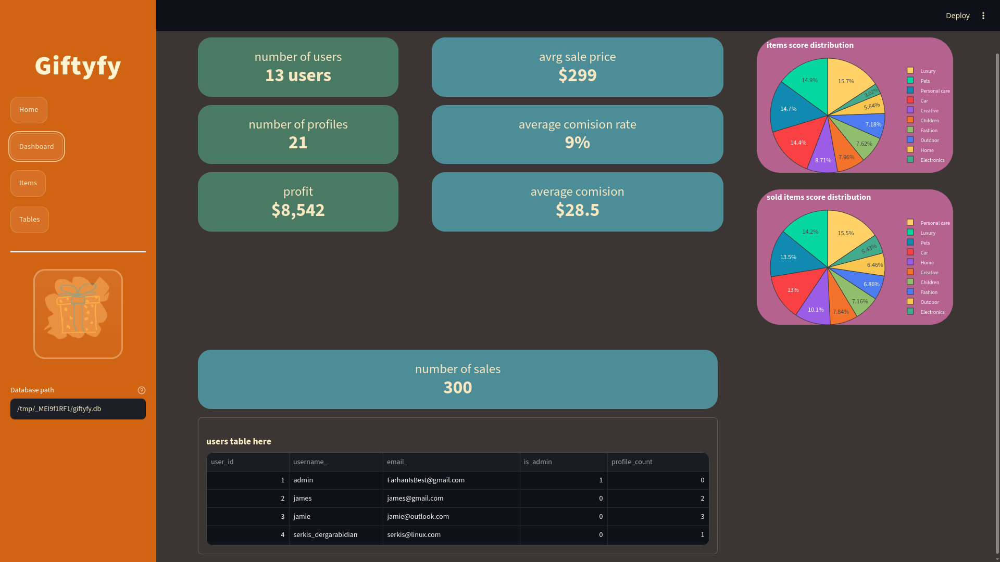
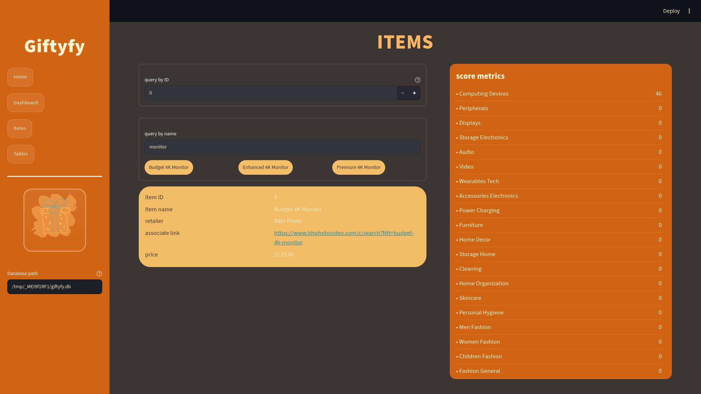
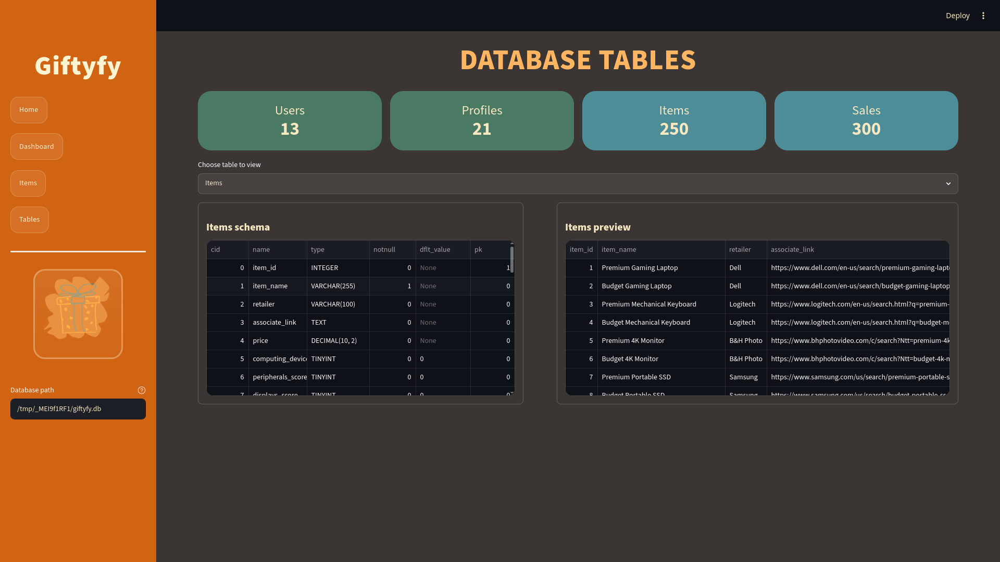
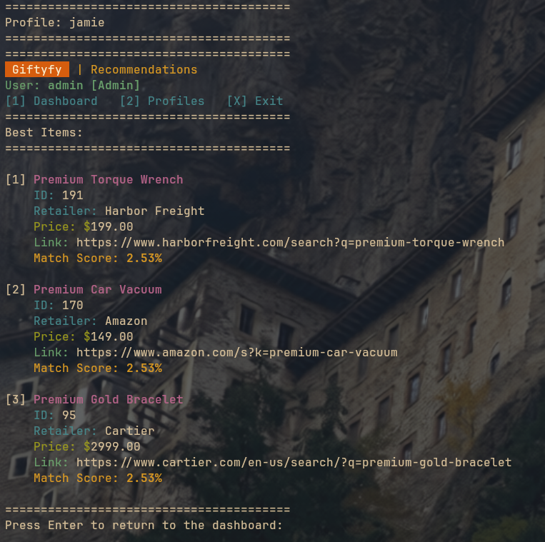

# Giftyfy

Giftyfy is a cross-platform gift-choosing assistant with a C++17 SQLite TUI app and a Python Streamlit dashboard for exploring, managing, and seeding gift data.

[](LICENCE)
[](https://github.com/Olygus/Gift-choosing-app)
[](https://github.com/Olygus/Gift-choosing-app/commits/main)

## Index

- [Features](#features)
- [Why this project exists](#why-this-project-exists)
- [Installation](#installation)
- [Usage](#usage)
- [Configuration](#configuration)
- [Screenshots](#screenshots)
- [Project structure](#project-structure)
- [License](#license)

## Features

- C++17 tui application that uses SQLite3.
- Streamlit dashboard for admins browsing data, tables, and KPIs.
- Dashboard with reusable UI templates for easy custumisation.
- Sample dataset for quick local testing.
- A wrapper that launches Streamlit inside a PyQt6 window.

## Why this project exists

This project began as an enterprise computing assignment and I decided to share it on github. It supports two main use cases
1) it can be used by businesses as an in‑store tool that helps customers quickly browse and choose gifts 
2) it also serves as a learning resource for people interested in understanding how a k‑nearest neighbour algorithm works in practice 

The goal is to keep the storage layer simple with SQLite while still being flexable and open.

## Installation

The project has two parts:

- The terminal app in [calculator.cpp](calculator.cpp)
- The dashboard in [app.py](app.py), optionally launched through [dashboard.py](dashboard.py)

Use the platform instructions below for the setup path you need.

### Start here

1. Clone the repository.

   ```bash
   git clone https://github.com/Olygus/Gift-choosing-app
   ```

2. Change into the project folder.

   ```bash
   cd Gift-choosing-app
   ```

<details>
<summary>Linux</summary>

### the main app

1. Install the C++ and SQLite dependencies.

   Debian / Ubuntu:

   ```bash
   sudo apt update
   sudo apt install git g++ libsqlite3-dev
   ```

   Arch Linux:

   ```bash
   sudo pacman -Syu base-devel sqlite
   ```

2. Build the application.

   ```bash
   g++ -std=c++17 -O2 -Wall -Wextra -o giftyfy calculator.cpp -lsqlite3
   ```

### Dashboard

1. Install Python tooling if needed.

   ```bash
   sudo apt install python3 python3-venv python3-pip
   ```

   On Arch Linux, you usually do not install `python3`, `python3-venv`, and `python3-pip` separately. The equivalent setup is:

   ```bash
   sudo pacman -S python
   ```

   Arch ships the Python runtime together with the standard `venv` and `pip` tooling through the `python` package, so the Debian / Ubuntu `apt` line is not needed there.

2. Create and activate a virtual environment.

   ```bash
   python3 -m venv .venv
   source .venv/bin/activate
   ```

3. Install dashboard dependencies.

   ```bash
   pip install streamlit pandas plotly PyQt6 PyQt6-WebEngine
   ```

</details>

<details>
<summary>Windows</summary>

### the main app

1. Install MinGW-w64 or Visual Studio Build Tools and make sure `g++` is available in your shell.
2. Install the SQLite3 development files or use a package manager such as MSYS2.
3. Build the application.

   ```cmd
   g++ -std=c++17 -O2 -Wall -Wextra -o giftyfy.exe calculator.cpp -lsqlite3
   ```

### Dashboard

1. Install Python 3.8 or newer.
2. Create and activate a virtual environment.

   ```powershell
   python -m venv .venv
   .\.venv\Scripts\Activate.ps1 # if using powershell
   source .venv/bin/activate # if using bash in MinGW-w64 or MSYS2 on windows
   ```

3. Install dashboard dependencies.

   ```powershell
   pip install streamlit pandas plotly PyQt6 PyQt6-WebEngine
   ```

</details>

<details>
<summary>macOS (untested)</summary>

### the main app

1. Install the command-line tools if they are not already present.

   ```bash
   xcode-select --install
   ```

2. Install SQLite and Python with Homebrew if needed.

   ```bash
   brew install sqlite python
   ```

3. Build the application.

   ```bash
   g++ -std=c++17 -O2 -Wall -Wextra -o giftyfy calculator.cpp -lsqlite3
   ```

### Dashboard

1. Create and activate a virtual environment.

   ```bash
   python3 -m venv .venv
   source .venv/bin/activate
   ```

2. Install dashboard dependencies.

   ```bash
   pip install streamlit pandas plotly PyQt6 PyQt6-WebEngine
   ```

</details>

## Usage

### the main app

Run the compiled binary after building it:

```bash
./giftyfy
```

### Streamlit dashboard

Launch the dashboard directly from the repository root:

```bash
python -m streamlit run app.py
```

### Desktop wrapper

Launch the dashboard in a desktop window with PyQt6:

```bash
python dashboard.py
```

### Sample data

Generate a populated SQLite database for local testing:

```bash
python db-generate-sample.py giftyfy.db
```

## Configuration

- The default database path is defined in [app.py](app.py) as `giftyfy.db` beside the script.
- The console app uses the same default SQLite file through [calculator.cpp](calculator.cpp).
- Default admin credentials and fallback seed values are also defined in [calculator.cpp](calculator.cpp) and can be updated before rebuilding.
- Dashboard styling comes from [assets/style.css](assets/style.css), and shared Streamlit fragments live in [assets/templates.py](assets/templates.py).

### Change default admin credentials and DB path

If you want to change the default admin login, update the related values in [calculator.cpp](calculator.cpp):

```cpp
const std::string adminUser = "admin";
const std::string adminPass = "admin123";
```

Replace `admin` and `admin123` with your preferred username and password, then rebuild the app.

The console app also contains an SQL fallback line for the default admin account in case it is missing:

```cpp
"UPDATE users_login SET password_ = 'admin123', email_ = 'FarhanIsBest@gmail.com', is_admin = 1 WHERE username_ = 'admin';",
```

Update that SQL string to match your new admin username, password, and email if you want the fallback to use your own values.

For the Streamlit dashboard, the default database file location is defined in [app.py](app.py):

```python
DEFAULT_DB_PATH = Path(__file__).with_name("giftyfy.db")
```

That value is used by the DB path input field as the default location. To use a different database path, set `DEFAULT_DB_PATH` to another location such as `Path("/absolute/path/to/giftyfy.db")`, then restart Streamlit.

### Optional: Load sample data

If you want a populated sample database for testing, run the seeding script before launching the app. This works on Debian / Ubuntu, Arch Linux, Windows, and other systems that have Python 3 installed.

```bash
python3 db-generate-sample.py giftyfy.db
```

On Windows, use:

```cmd
python db-generate-sample.py giftyfy.db
```

This resets the sample tables and inserts users, profiles, items, and sales data that match the SQLite schema used by the app.

### Run the Streamlit dashboard locally

Prerequisites:

- Python 3.8 or newer
- A Python virtual environment is recommended
- `streamlit`, `pandas`, and `plotly`
- `pyinstaller` if you want to package the dashboard launcher

Install the Python dependencies first:

```bash
pip install streamlit pandas plotly
```

Linux:

```bash
# from the folder where you cloned the repository
cd Gift-choosing-app

# create a venv if needed
python3 -m venv .venv

# activate the project's venv if you created one
source .venv/bin/activate

# then run Streamlit
python -m streamlit run app.py

# or run the venv python directly when your path contains spaces
"./.venv/bin/python" -m streamlit run app.py
```

Windows (PowerShell):

```powershell
# from the folder where you cloned the repository
cd "C:\path\to\Gift-choosing-app"

# activate venv created with `python -m venv .venv`
.\.venv\Scripts\Activate.ps1
python -m streamlit run app.py
```

Windows (Command Prompt):

```cmd
cd "C:\path\to\Gift-choosing-app"
.venv\Scripts\activate.bat
python -m streamlit run app.py
```

Notes:

- If you created the virtual environment in a different location, replace the `.venv` path above with your environment's Python executable.
- If you use WSL, run the Linux commands from the respective WSL shell.
- If Streamlit cannot find the database, verify that `DEFAULT_DB_PATH` points to the expected `giftyfy.db` file.

### Package the dashboard with PyInstaller

If you want to build a standalone dashboard launcher, install PyInstaller and package `dashboard.py`.

```bash
pip install pyinstaller
pyinstaller --noconsole --onefile --name dashboard --add-data "app.py:." --add-data "giftyfy.db:." --add-data "assets/logo.png:assets" --add-data "assets/style.css:assets" --add-data "assets/templates.py:assets" dashboard.py
```

Then launch it from the `dist` folder:

```bash
./dist/dashboard
```

If you have trouble with PyInstaller, make sure your Python environment is activated before building.

## Screenshots

The screenshots below use the captured images in the `img/` folder.

| Dashboard home | Items view |
| --- | --- |
|  |  |

| Tables view | Console app |
| --- | --- |
|  |  |

## Project structure after setup

```text
Gift-choosing-app/
├── README.md              # you are reading it right now, it contains the setup and usage instructions
├── .gitattributes         # github files for code
├── .gitignore             # makes sure sensative or local files dont make it to github
├── .venv/                 # local python virtual environment
├── LICENCE                # Apache 2.0 license text, read before use
├── calculator.cpp         # C++17 tui app with SQLite-backed admin and table flows, contains most of the source code for masking passwords, vaalidating input and calculating distance.
├── app.py                 # the Streamlit dashboard and data access layer
├── dashboard.py           # PyQt6 launcher that embeds Streamlit in a desktop window
├── dashboard.spec         # PyInstaller spec for packaging the dashboard wrapper (not in repo, it is created by python)
├── giftyfy.spec           # PyInstaller spec for packaging the console app (not in repo, created by python)
├── db-generate-sample.py  #creates a sample for testing app
├── schema.sql             # the schema used by the app and sample generator
├── img/                   # images for github
│   ├── console-app.png    #screenshot
│   ├── dashboard.png      #screenshot
│   ├── items-view.png     #screenshot
│   └── table-view.png     #screenshot
├── assets/                # random files for app
│   ├── logo.png           # hand drawn app logo
│   ├── style.css          # the css for the dashboard
│   └── templates.py       # reusable boilerplate for creating new dashboard pages
├── giftyfy.db             # the database with the schema.sql schema (not in repo, generated by calculator, db-generator, schema.sql or imported by user for custom use)
├── build/                 # build artafacts (not in repo, generated by python)
└── dist/                  # where you dashboard lauch file lives
```

## License

This project is licensed under [Apache 2.0](LICENCE).
